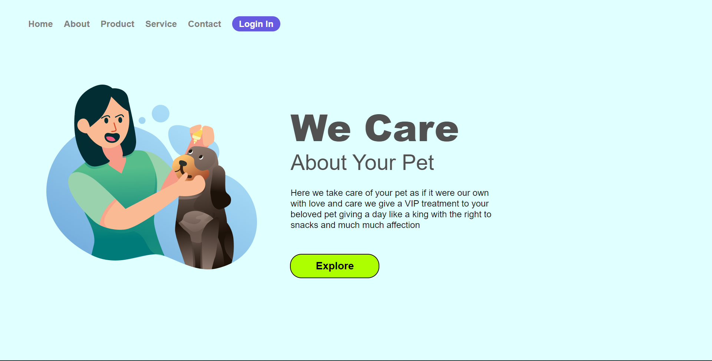
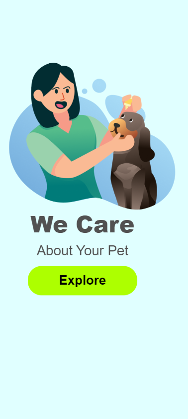

<h1> <i> Pet Care </i> </h1>

<h2> <ul> <li> Um Projeto totalmente feito com proposito de treinar a responsividade para <i>Mobiles</i>, com ajuda do metódo de ensinamento do <a href="https://www.linkedin.com/in/rodolfomori" target=_blank> Rodolfo Mori </a> </li> </ul> </h2>

<h3> <i> Tecnologias utilizadas para o projeto </i> </h3>

<h4> 
    <ol> 
         <li> <b> CSS  </b> </li>
         <li> <b> HTML </b> </li>
    </ol>
</h4> 
 

<h3> <i> Fotos representando em cada dispositivo: </i> </h3>
 

<h4> <ul> <li> <i> Desktop </i> </li> </ul> </h4>

<h4> <ul> <li> <i> Mobile </i> </li> </ul> </h4>
